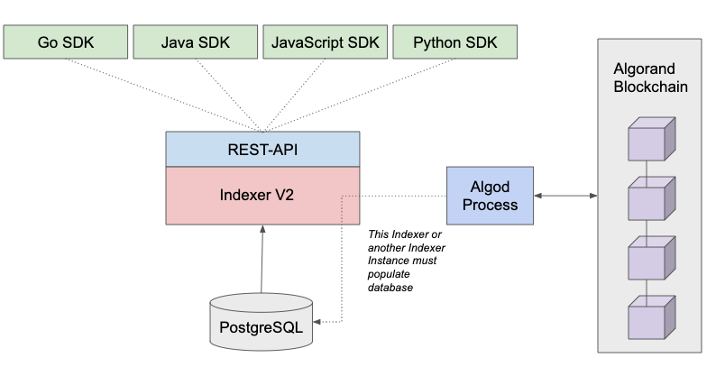

# Dotnet Algorand SDK

> ### **IMPORTANT **
>
> Dotnet-algorand-sdk Version 0.2.X modifies the namespace of algod API 1.0 compared to  dotnet-algorand-sdk Version 0.1.X. Please replaces the namespaces below:
>
> Replace **Algorand.Algod.Client.Model** with **Algorand.Algod.Model**
>
> Replace **Algorand.Algod.Client.Api** with **Algorand.Algod.Api**
>
> Replace **Algorand.Kmd.Client.Model** with **Algorand.Algod.Model**
>
> Replace **Algorand.Kmd.Client.Api** with **Algorand.Kmd.Api**
>
> Replace **Algorand.Algod.Client** with **Algorand.Client**
>
> Replace **Algorand.Kmd.Client** with **Algorand.Client**
>
> Everything else remains the same.

The SDK version 0.2 add the support of Algorand Api 2.0 and the Indexer Api.

dotnet-algorand-skd is a dotnet library for communicating and interacting with the Algorand network. It contains a REST client for accessing algod instances over the web, and also exposes functionality for mnemonics, creating transactions, signing transactions, and serializing data across the network.

Please find documents of dotnet-algorand-sdk on https://rileyge.github.io/dotnet-algorand-sdk/.

## 1. Prerequisites

This library is compliant to .Net Standard 2.0.

## 2. How to Install

Open the NuGet command line and type:

```powershell
Install-Package Algorand
```

## 3. Quick Start for algod API 1.0

```csharp
string ALGOD_API_ADDR = "your algod api address"; //find in algod.net
string ALGOD_API_TOKEN = "your algod api token"; //find in algod.token
AlgodApi algodApiInstance = new AlgodApi(ALGOD_API_ADDR, ALGOD_API_TOKEN);
```

dotnet-algorand-sdk has good support for PureStake, you can connect to PureStake by replacing the ALGOD_API_TOKEN use PureStake API KEY.

Get information from algorand blockchain:

``` csharp
try
{
    Supply supply = algodApiInstance.GetSupply();
    Console.WriteLine("Total Algorand Supply: " + supply.TotalMoney);
    Console.WriteLine("Online Algorand Supply: " + supply.OnlineMoney);
}
catch (ApiException e)
{
    Console.WriteLine("Exception when calling algod#getSupply: " + e.Message);
}
ulong? feePerByte;
string genesisID;
Digest genesisHash;
ulong? firstRound = 0;
try
{
    TransactionParams transParams = algodApiInstance.TransactionParams();
    feePerByte = transParams.Fee;
    genesisHash = new Digest(Convert.FromBase64String(transParams.Genesishashb64));
    genesisID = transParams.GenesisID;
    Console.WriteLine("Suggested Fee: " + feePerByte);
    NodeStatus s = algodApiInstance.GetStatus();
    firstRound = s.LastRound;
    Console.WriteLine("Current Round: " + firstRound);
}
catch (ApiException e)
{
    throw new Exception("Could not get params", e);
}
```

If you want to go further, you should have an account.  You can use `Account acc = new Account();` to generate a random account. Surely you can use mnemonic to create an account. The example below using mnemonics to create an account and send some algos to another address.

```csharp
ulong? amount = 100000;
ulong? lastRound = firstRound + 1000; // 1000 is the max tx window
string SRC_ACCOUNT = "typical permit hurdle hat song detail cattle merge oxygen crowd arctic cargo smooth fly rice vacuum lounge yard frown predict west wife latin absent cup";
Account src = new Account(SRC_ACCOUNT);
Console.WriteLine("My account address is:" + src.Address.ToString());
string DEST_ADDR = "KV2XGKMXGYJ6PWYQA5374BYIQBL3ONRMSIARPCFCJEAMAHQEVYPB7PL3KU";
Transaction tx = new Transaction(src.Address, new Address(DEST_ADDR), amount, firstRound, lastRound, genesisID, genesisHash);
//sign the transaction before send it to the blockchain
SignedTransaction signedTx = src.SignTransactionWithFeePerByte(tx, feePerByte);
Console.WriteLine("Signed transaction with txid: " + signedTx.transactionID);
// send the transaction to the network
try
{
    //encode to msg-pack
    var encodedMsg = Algorand.Encoder.EncodeToMsgPack(signedTx);
    TransactionID id = algodApiInstance.RawTransaction(encodedMsg);
    Console.WriteLine("Successfully sent tx with id: " + id.TxId);
}
catch (ApiException e)
{
    // This is generally expected, but should give us an informative error message.
    Console.WriteLine("Exception when calling algod#rawTransaction: " + e.Message);
}
```

That's all? Yes, this is a complete example, you can find more examples in the sdk-examples project.

## 4. Quick Start for algod API 2.0

Algod API 2.0 has a lot of good features, such as dryrun debugging and teal compile. So it is highly recommended to use the API 2.0 to build your program.

In dotnet-algorand-sdk, the algod API 2.0 is almost the same as API 1.0. The most important change is using the namespace **Algorand.V2**. Let's try some code.

```csharp
string ALGOD_API_ADDR = "your algod api address"; //find in algod.net
string ALGOD_API_TOKEN = "your algod api token"; //find in algod.token
AlgodApi algodApiInstance = new AlgodApi(ALGOD_API_ADDR, ALGOD_API_TOKEN);

try
{
    var supply = algodApiInstance.GetSupply();
    Console.WriteLine("Total Algorand Supply: " + supply.TotalMoney);
    Console.WriteLine("Online Algorand Supply: " + supply.OnlineMoney);
}
catch (ApiException e)
{
    Console.WriteLine("Exception when calling algod#getSupply: " + e.Message);
}

try
{
    var transParams = algodApiInstance.TransactionParams();
    Console.WriteLine("Transaction Params: " + transParams.ToJson());
}
catch (ApiException e)
{
    throw new Exception("Could not get params", e);
}
```

It's very difficult to tell the difference between API 1.0 and API 2.0 besides the namespace is different. So if you are familiar with API 1.0, it's very easy to use API 2.0.

You can find more examples in the **sdk-examples** project.

## 5. Quick Start for Indexer

As we all know blockchain has a chain data struct, so it's very different for us to search the data. So algorand retrieve the blockchain data from a PostgreSQL compatible database. Then we can search for the blockchain very easily.



The indexer has 12 methods to search the blockchain and some of these methods have a lot of variables to control the result. Let's try some code.

```csharp
string ALGOD_API_ADDR = "your algod api address";
string ALGOD_API_TOKEN = "your algod api token";

IndexerApi indexer = new IndexerApi(ALGOD_API_ADDR, ALGOD_API_TOKEN);
//AlgodApi algodApiInstance = new AlgodApi(ALGOD_API_ADDR, ALGOD_API_TOKEN);
var health = indexer.MakeHealthCheck();
Console.WriteLine("Make Health Check: " + health.ToJson());

System.Threading.Thread.Sleep(1200); //test in purestake, imit 1 req/sec
var address = "KV2XGKMXGYJ6PWYQA5374BYIQBL3ONRMSIARPCFCJEAMAHQEVYPB7PL3KU";
var acctInfo = indexer.LookupAccountByID(address);
Console.WriteLine("Look up account by id: " + acctInfo.ToJson());

System.Threading.Thread.Sleep(1200); //test in purestake, imit 1 req/sec
var transInfos = indexer.LookupAccountTransactions(address, 10);
Console.WriteLine("Look up account transactions(limit 10): " + transInfos.ToJson());

System.Threading.Thread.Sleep(1200); //test in purestake, imit 1 req/sec
var appsInfo = indexer.SearchForApplications(limit: 10);
Console.WriteLine("Search for application(limit 10): " + appsInfo.ToJson());

var appIndex = appsInfo.Applications[0].Id;
System.Threading.Thread.Sleep(1200); //test in purestake, imit 1 req/sec
var appInfo = indexer.LookupApplicationByID(appIndex);
Console.WriteLine("Look up application by id: " + appInfo.ToJson());

System.Threading.Thread.Sleep(1200); //test in purestake, imit 1 req/sec
var assetsInfo = indexer.SearchForAssets(limit: 10, unit: "LAT");
Console.WriteLine("Search for assets" + assetsInfo.ToJson());

var assetIndex = assetsInfo.Assets[0].Index;
System.Threading.Thread.Sleep(1200); //test in purestake, imit 1 req/sec
var assetInfo = indexer.LookupAssetByID(assetIndex);
Console.WriteLine("Look up asset by id:" + assetInfo.ToJson());
```

Please enjoy!!!
